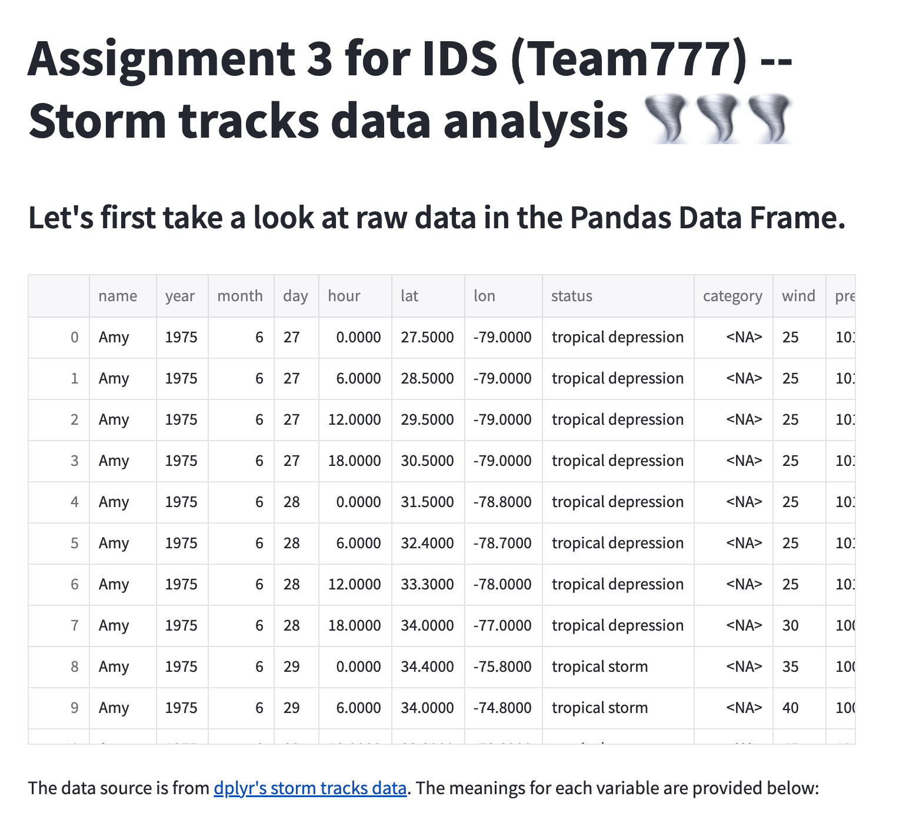
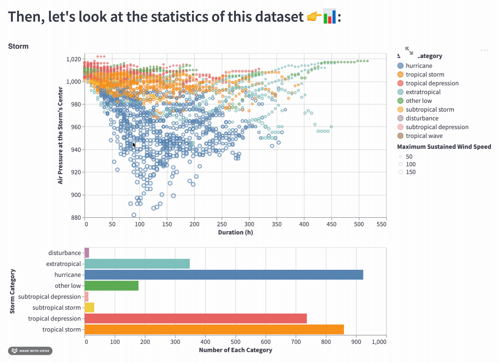

# Assignment 3 for IDS (Team777) -- Storm tracks data analysis 🌪🌪🌪

### Screenshot

TODO: Update screenshot

TODO: Short abstract describing the main goals and how you achieved them.

### Abstract
The data source is Storm Tracks. Our main goal is to exhibit the tracks of certain storms and their statistical relationship among the features of data. We achieve this by preprocessing the data and drawing interactive scatter plot, bar plot, heatmap, and the world map.

## Project Goals

TODO: **A clear description of the goals of your project.** 
Questions we want users to answer: What are the tracks of and patterns of the storms? What is the relationship among wind speed, pressure, date, storm type, duration of storms, and storm diameters?

## Design

TODO: **A rationale for your design decisions.** 
We choose interactive scatter plot, bar plot, heatmap, and world map. We also have considered the static graphs, streamgraphs, horizon graph, so on and so forth. The reasons we for our final choices are that interactiveness is necessary, and according to our data, the time is not strictly continuous so we cannot apply certain type of graphs.

## Development

TODO: **An overview of your development process.** 
Zhi Jing is responsible for the scatter plots, bar plots, heatmaps, and the layout of the webpage. Yifei Wei is responsible for the world map visualization. We both contribute to the improvement of the final version of our assignment.

- Zhi Jing:
I spend about 16 hours in total for discussion, picking dataset, topic/graph design, coding, webpage layout arrangement. The coding took the most of time, about 8 hours, essentially because I have to try a lot of graph to see the effect and choose whether to use or not.

- Yifei Wei:
TODO

Describe how the work was split among the team members. Include a commentary on the development process, including answers to the following questions: Roughly how much time did you spend developing your application (in people-hours)? What aspects took the most time?

## Success Story

TODO:  **A success story of your project.** 
We successfully deliever the exhibition of storm tracks and their statistics.

Describe an insight or discovery you gain with your application that relates to the goals of your project.

